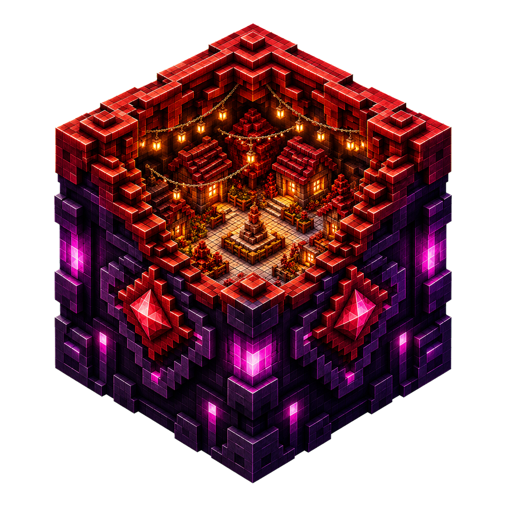
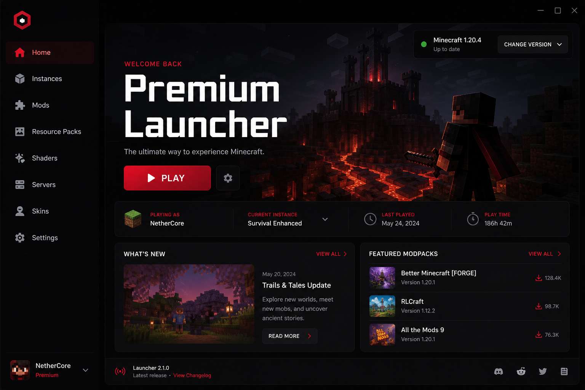
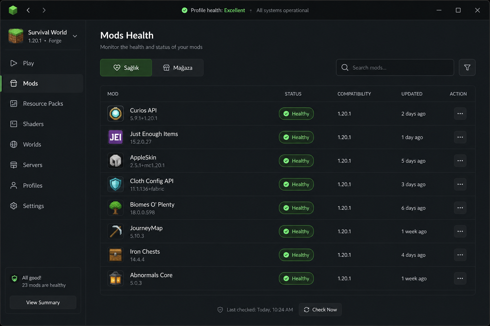
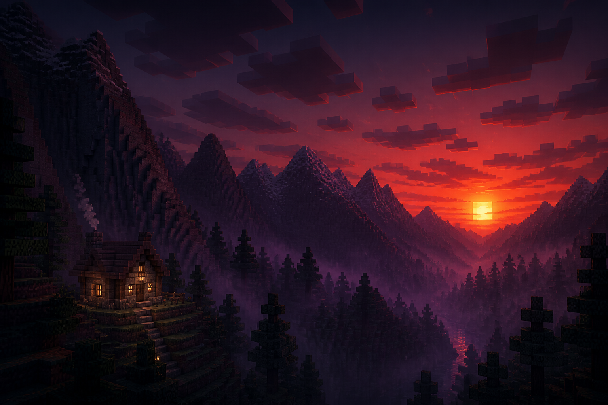

  

<h1 align="center">Premium Launcher</h1>

  <strong>Modern, player-first Minecraft launcher for Windows</strong> 
  Isolated profiles · Skin Studio · Mod health · Secure updates · Premium desktop UX

  
  
  

> **Public portfolio only.** Product source, build internals and first-party assets remain private. This repository presents the product without publishing its implementation.

## Product

Premium Launcher turns Minecraft setup into a clear three-step flow: connect an account, choose an isolated profile, and play. Advanced controls remain available without overwhelming new players.

## Current capabilities

| Area | Experience |
|---|---|
| Accounts | Microsoft and offline accounts with first-run account gate |
| Profiles | Isolated Vanilla, Fabric, Forge and NeoForge installations |
| Skin Studio | Automatic account skin, local PNG import, Classic/Slim choice and interactive 3D preview |
| Content | Modrinth discovery, mods, resource packs, shaders and worlds |
| Reliability | Mod-health checks, crash diagnostics, managed Java and repair actions |
| Servers | Saved servers and direct join |
| Desktop | Responsive Forgeboard shell, animated voxel hero, tray behavior and integrated titlebar |
| Updates | Dedicated release channel, SHA-256 verification and Defender release audit |

## Gallery

| Surface | Preview |
|---|---|
| Home |  |
| Profiles |  |
| Mods |  |
| Settings |  |
| Brand atmosphere |  |

More visuals: [Gallery](docs/gallery.md)

## Product principles

- Player-first hierarchy: account → profile → Play
- One coherent anthracite shell with crimson actions and restrained violet depth
- Clear status by exception; healthy states stay quiet
- Isolated data and reversible profile operations
- No hidden account tokens in the browser layer
- Release integrity independent from source visibility

## Technology overview

Windows desktop host · Python application core · embedded HTML/CSS/JavaScript interface · Minecraft runtime and loader integrations · local 3D skin rendering.

Implementation details, authentication internals and build pipelines are intentionally omitted.

## Distribution

Official installers and update artifacts are published through [premium-launcher-updates](https://github.com/eraykoka/premium-launcher-updates). The source repository is private.

## License

Portfolio text and media are provided for evaluation only. All rights reserved. See [LICENSE](LICENSE).

## Contact

GitHub: [@eraykoka](https://github.com/eraykoka)

Designed and developed by Eray Akbay.

