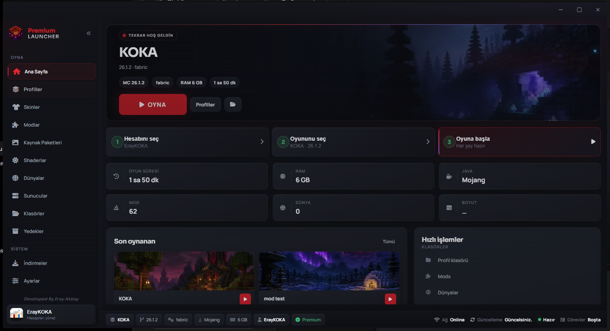
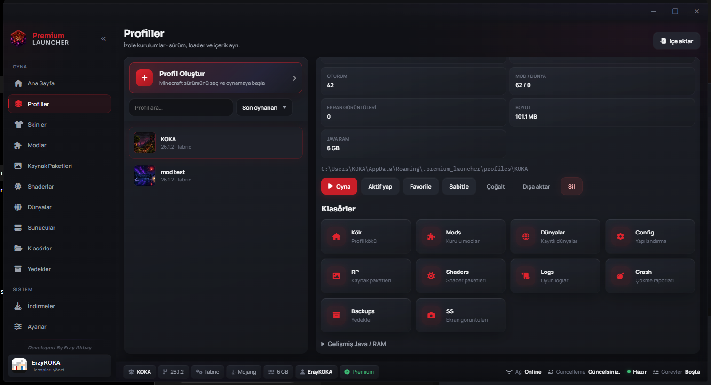
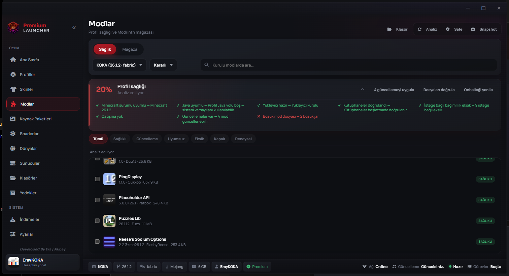
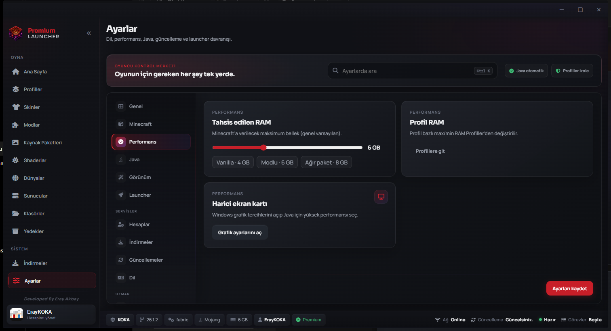
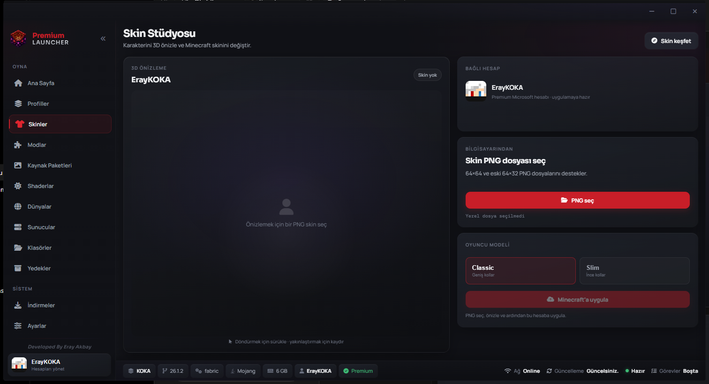

  

<h1 align="center">Premium Launcher</h1>

  <strong>Modern, player-first Minecraft launcher for Windows</strong> 
  Isolated profiles · Skin Studio · Mod health · Secure updates · Premium desktop UX

  
  
  

> **Public portfolio only.** Product source, build internals and first-party assets remain private.  
> This repository is the recruiter-facing product showcase — not the implementation.

---

## Recruiter 2-minute scan

| Signal | Evidence |
|--------|----------|
| Product sense | Account → profile → Play hierarchy; gallery below |
| Desktop craft | Forgeboard shell, Skin Studio 3D preview, tray/titlebar |
| Reliability engineering | Mod-health, crash diagnostics, managed Java, repair |
| Release integrity | Dedicated update channel · SHA-256 · Defender audit |
| IP judgment | Source stays private; public docs + media only |

**Download:** [Latest Windows installer](https://github.com/eraykoka/premium-launcher-updates/releases/latest/download/PremiumLauncher-Setup.exe)  
**Release channel:** [premium-launcher-updates](https://github.com/eraykoka/premium-launcher-updates/releases) · Current: **v1.0.3**

---

## Product

Premium Launcher turns Minecraft setup into a clear three-step flow: connect an account, choose an isolated profile, and play. Advanced controls stay available without overwhelming new players.

## Capabilities

| Area | Experience |
|---|---|
| Accounts | Microsoft and offline accounts with first-run account gate |
| Profiles | Isolated Vanilla, Fabric, Forge and NeoForge installations |
| Skin Studio | Automatic account skin, local PNG import, Classic/Slim, interactive 3D preview |
| Content | Modrinth discovery, mods, resource packs, shaders and worlds |
| Reliability | Mod-health checks, crash diagnostics, managed Java and repair actions |
| Servers | Saved servers and direct join |
| Desktop | Responsive Forgeboard shell, animated voxel hero, tray, integrated titlebar |
| Updates | Dedicated release channel, SHA-256 verification, Defender release audit |

## Gallery

| Surface | Preview |
|---|---|
| Home |  |
| Profiles |  |
| Mods |  |
| Settings |  |
| Skin Studio |  |

More: [Gallery](docs/gallery.md) · [Architecture](architecture/overview.md) · [Roadmap](ROADMAP.md) · [FAQ](docs/faq.md)

## Product principles

- Player-first hierarchy: account → profile → Play
- One coherent anthracite shell with crimson actions
- Clear status by exception; healthy states stay quiet
- Isolated data and reversible profile operations
- No hidden account tokens in the browser layer
- Release integrity independent from source visibility

## Technology overview

Windows desktop host · Python application core · embedded HTML/CSS/JavaScript interface · Minecraft runtime and loader integrations · local 3D skin rendering.

Implementation details, authentication internals and build pipelines are intentionally omitted.

## License

Portfolio text and media for evaluation only. All rights reserved. See [LICENSE](LICENSE).

## Contact

GitHub: [@eraykoka](https://github.com/eraykoka)

Designed and developed by Eray Akbay.

