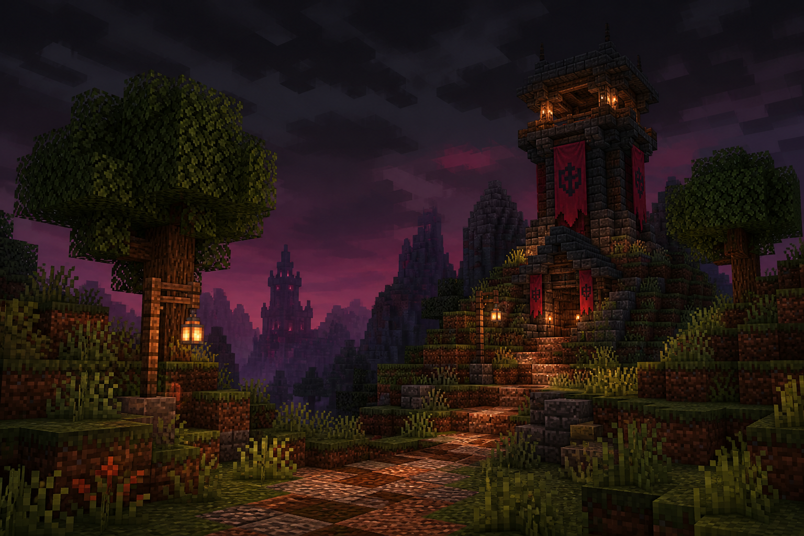
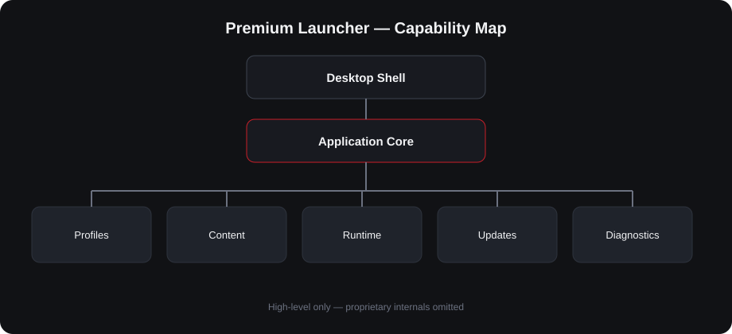

<p align="center">
  
</p>

<h1 align="center">Premium Launcher</h1>

<p align="center">
  <strong>A commercial-grade Windows Minecraft launcher</strong><br/>
  Profile isolation · Mod health · Secure updates · Studio-depth desktop UI
</p>

<p align="center">
  <a href="#key-features">Features</a> ·
  <a href="#gallery">Gallery</a> ·
  <a href="#architecture-overview">Architecture</a> ·
  <a href="#technology-stack">Stack</a> ·
  <a href="ROADMAP.md">Roadmap</a> ·
  <a href="CHANGELOG.md">Changelog</a>
</p>

<p align="center">
  
  
  
  
</p>

> **Portfolio repository.** This public repo documents product vision, design, and engineering outcomes.  
> Proprietary source code, internals, and competitive implementation details are **not** published here.

---

## Project overview

**Premium Launcher** is a Windows desktop product that helps players manage Minecraft installations with confidence: isolated profiles, mod health diagnostics, store discovery, and a polished dark UI designed like a modern productivity tool—not a cluttered hobby script.

### Why it exists

Most launcher experiences force a tradeoff: either power-user complexity or shallow convenience. Premium Launcher targets a third path:

- **Product-quality UI** for daily use
- **Strong isolation** so packs and experiments don’t corrupt each other
- **Health-first mod management** so “Play” is trustworthy
- **Safe update channel** so users receive improvements without friction

### What visitors should take away (2 minutes)

| Signal | Evidence in this repo |
|--------|------------------------|
| Product thinking | Feature docs · FAQ · roadmap |
| Systems design | High-level architecture diagrams |
| UI craft | Gallery · design philosophy |
| Delivery discipline | Changelog · release notes style |
| Judgment | Proprietary source kept private |

---

## Key features

### Profile isolation
Each play setup lives in its own sandbox. Worlds, mods, and settings stay separated so experimentation is safe.

### Mod health center
A dedicated surface to understand whether a profile is ready to play—compatible, missing pieces, updates, and quiet filterable lists.

### Mod discovery store
Search and install community content from a curated marketplace experience integrated into the same workflow.

### Managed Java runtime
The product aims to remove “wrong Java version” dead ends with guided runtime readiness.

### Multi-loader support
Vanilla · Fabric · Forge · NeoForge profiles are first-class product concepts.

### Desktop shell polish
Fixed navigation rail, responsive desktop layouts, intentional motion, system-tray friendly window behavior.

### Secure auto-update path
Users receive versioned improvements through a dedicated public update channel with integrity checks. *(Implementation details intentionally omitted.)*

### Installer experience
Dependency readiness and first-run setup are treated as product surfaces, not afterthoughts.

### Worlds & content library
Browse and manage worlds, packs, and related content from a unified library mindset.

### Diagnostics & trust
Clear user-facing status when something blocks launch; quiet confidence when everything is healthy.

---

## Gallery

Jump straight to visuals—no wall of text required.

| Surface | Preview |
|---------|---------|
| Home / brand atmosphere |  |
| Library / recent play |  |
| Recent session card |  |
| Home mock |  |
| Profiles mock |  |
| Mods health mock |  |
| Settings mock |  |
| Architecture map |  |

More: [`docs/gallery.md`](docs/gallery.md) · Videos folder: [`videos/`](videos/)

> Replace mock frames with production screenshots anytime—keep filenames stable so the README keeps working.

---

## Technology stack

High-level only:

| Layer | Choices |
|-------|---------|
| Host platform | Windows desktop application |
| Application core | Python |
| Presentation | HTML · CSS · JavaScript (embedded desktop web UI) |
| Game ecosystem | Minecraft client runtimes & popular mod loaders |
| Distribution | Versioned releases + integrity-aware update channel |
| Design system | Custom “Studio Depth” dark UI tokens |

Exact libraries, private modules, auth protocols, packaging internals, and build pipelines are **not** disclosed.

---

## Architecture overview

Conceptual product architecture (no class maps, no internal APIs):

```text
┌──────────────────────────────────────────────┐
│                 Desktop Shell                │
│         (window · navigation · tray)         │
└──────────────────────┬───────────────────────┘
                       │
         ┌─────────────▼─────────────┐
         │     Application Core      │
         └─────────────┬─────────────┘
       ┌───────────────┼───────────────┐
       ▼               ▼               ▼
┌────────────┐  ┌────────────┐  ┌────────────┐
│  Profiles  │  │   Content  │  │   Trust &  │
│  Manager   │  │  (mods /   │  │  Updates   │
│            │  │  worlds)   │  │            │
└─────┬──────┘  └──────┬─────┘  └──────┬─────┘
      │                │               │
      └────────┬───────┴───────┬───────┘
               ▼               ▼
        ┌────────────┐  ┌────────────┐
        │  Runtime   │  │ Diagnostics│
        │  Readiness │  │ & Support  │
        └────────────┘  └────────────┘
```

Detailed write-up: [`architecture/overview.md`](architecture/overview.md)

---

## Design philosophy

- **Tool, not dashboard spam** — primary actions and lists win vertical space
- **Token-first UI** — consistent color, type, space; crimson for action; purple ambient only
- **Border-first elevation** — calm surfaces, no neon glass clutter
- **Desktop-native density** — fixed rail, reflowing content, no whole-app zoom hacks
- **Health by exception** — when everything is fine, stay quiet; when not, be explicit

See [`docs/design-philosophy.md`](docs/design-philosophy.md)

---

## Development process

- Dual output: shipping product + durable documentation discipline
- Decision records for architectural forks (kept private when sensitive)
- Release cadence with changelogs and integrity-minded distribution
- Continuous UI refinement from real usage friction (e.g. list-first Mods)

See [`docs/development-process.md`](docs/development-process.md)

---

## Roadmap

Public product themes (not implementation tickets): [`ROADMAP.md`](ROADMAP.md)

---

## FAQ

See [`docs/faq.md`](docs/faq.md)

**Is the source code open?** No. This repository is a portfolio showcase.  
**Can I fork and rebuild it?** Not from this repo—by design.  
**Where do users get builds?** Through the product’s official distribution/update channel.

---

## License

All rights reserved. See [`LICENSE`](LICENSE).

This repository’s documentation and media may be viewed for evaluation (recruiting / interviews).  
Redistribution of assets or reverse-engineering of the product is not permitted.

---

## Security

Please report suspected vulnerabilities privately. See [`SECURITY.md`](SECURITY.md).  
Do **not** open public issues that include exploit detail against production users.

---

## Contribution policy

External code contributions are not accepted (proprietary product).  
Feedback on the *portfolio presentation* is welcome via GitHub Discussions/Issues if enabled.

See [`CONTRIBUTING.md`](CONTRIBUTING.md)

---

## Contact

- GitHub: [@eraykoka](https://github.com/eraykoka)
- Portfolio repos are intended for recruiters, clients, and interview panels

---

<p align="center"><sub>Built as a real product. Documented as a professional portfolio. Source kept proprietary.</sub></p>
