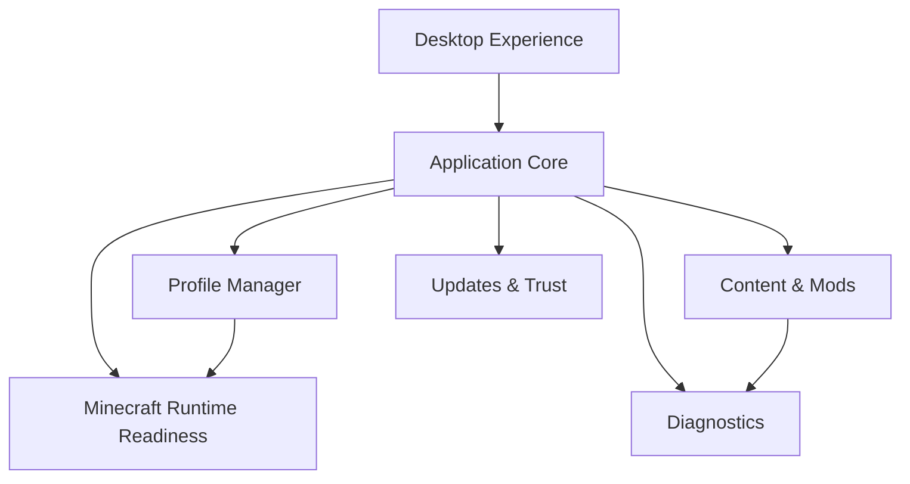

# Architecture Overview (High Level)

## Intent

Explain how the product is shaped—not how to rebuild it.

## Capability map

## Design constraints (public)

- **Isolation first** — profiles should not silently share mutable game state
- **Privilege boundary** — the UI presents; the host enforces
- **Fail closed on integrity** — untrusted updates must not apply
- **Fail open on optional content warnings** — don’t block play for soft issues

## Explicitly not documented here

Module graphs, class names, auth protocol steps, update binary layouts, installer scripts, and proprietary algorithms.
